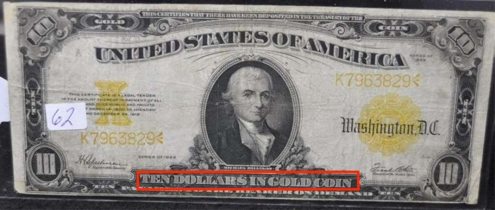

[EBS 다큐프라임 자본주의 제1부 돈은 빚이다](https://youtu.be/0LYMTsj_eqc?t=3022)와
[돌디](https://www.youtube.com/channel/UClmxSq4_kJfLtyIY7TycFfw) 님의 [금리](https://youtu.be/LzpNvyvTmIE), [돈은 가짜다 - 저축만 해서 망하는 이유](https://youtu.be/jqeXqLJMYl0?t=590) 영상을 보면 좀 더 많은 인사이트를 쌓을 수 있다.

## 왜 한국은 한국 금리에만 의존할 수 없는 걸까?
그 이유는 바로 무역 때문이다.  
대부분의 나라가 무역을 하기 때문에 그 나라의 금리에만 의존할 순 없을 것이다.  
더군다나 우리 나라는 자원(석유, 나무, 철광석 등등)이 거의 없다.  
대부분 외국에서 수입에 의존하기 때문이다.  
이렇게 수출/수입을 할 때 쓰는 돈이 `기축통화`인데 우리나라의 통화는 기축통화가 아니기 때문에 우리나라의 금리에만 의존할 수가 없는 거다.

### 기축통화 - 우리가 미국 금리에 의존할 수 밖에 없는 이유
기축통화는 `국제거래에 통용되는 결제 수단`으로서 가장 의미있는 돈이 기축통화인데, 현재 기축통화는 미국의 달러($)이다.  

그럼 어떻게 달러가 기축통화가 되었을까?  
현재 미국이 경제대국이지만 과거에는 영국이 경제대국이었다.  
그래서 2차 세계 대전 이전에는 영국의 파운드(£)가 기축통화였다.  
하지만 2차 세계 대전 당시에 영국은 전쟁 자금을 마련하기 위해 미국으로부터 많은 돈을 빌렸고,
그 돈을 갚기 위해 영국은 많은 금을 미국에 지불하게 된다.  
대부분 금을 제일 많이 가지고 있는 국가가 패권을 가지게 되고, 그로 인해 미국이 패권을 가지게 됨으로써 `1944년 미국 브레튼우즈 협정`에서 달러가 기축통화가 되었다.

### 달러의 의미
[돈은 빚이다](/2019/08/15/money-is-debt#최초의-은행)에서 말했다 싶이 금은 들고다니기 불편하므로 대부분의 사람이 금고에 금을 맡기고, 금 보관증으로 거래를 하기 시작했다.  
기축통화가 된 달러도 마찬가지였다.  
35 달러를 가져오면 금 1oz로 교환해주겠다고 `1944년 미국 브레튼우즈 협정`에서 정해졌다. (이를 `금 본위제 또는 금 태환제`라고 부른다.)
  
즉, `달러는 금 보관증`으로써 작용하기 시작했다. 

하지만 그 이후에 베트남 전쟁으로 달러의 가치가 하락하기 시작했다.  
달러의 가치가 하락했다는 것은 수요/공급 법칙에 의해 달러의 공급이 많아졌음을 의미한다.  
즉, 공급이 많아졌다는 것은 중앙은행에서 달러를 많이 찍어냈음을 의미한다.  
왜냐하면 전쟁을 하려면 많은 돈이 필요하기 때문이다.  
그만한 금이 없음에도 불구하고 미국은 자신의 금고 안에 금이 얼마나 들어있는지는 미국 자신 밖에 모르기 때문에 `없는 금을 교환`해준다고 교환증(달러)을 마구 찍어댄 게 아닐까 싶다.

그래서 미국에 수출을 해서 달러를 벌어들인 각국은 달러의 가치를 점점 의심하기 시작한다.  
그 결과 많은 국가가 `달러(금 보관증)`를 금으로 바꾸기 시작한다.  
엎친데 덮친격으로 미국은 무역 적자(수출액 < 수입액)였기 때문에 금은 점점 더 미국 밖으로 유출되기 시작한다.  

역사적으로 금을 가장 많이 가진 국가가 패권을 쥐기 때문에 금의 유출이 두려웠던 미국은 `1971년 닉슨 대통령`에 의해 금 본위제(달러를 금으로 교환)를 폐지하도록 한다.  
왜냐하면 돈은 종이 쪼가리에 불과하기 때문에 중앙은행에서 찍어대기만 하면 되지만, 금은 실물이기 때문에 돈보다 생성(혹은 확보)해내기가 훨씬 어려웠기 때문이다.  
물론 폐지할 때도 영구적으로 폐지한다고 하면 달러(금 보관증)를 소유한 나라의 반발이 심할 것이므로 미국의 경제가 살아날 때까지 임시 방편으로 폐지하는 것처럼 얘기했지만 그 이후 금 본위제는 부활하지 않고 있다.

  
이제 달러는 금으로부터 자유로워졌고, 단순히 종이 쪼가리에 불과하게 된다.  
즉, 금의 보유량과 상관없이 이제 마구잡이로 찍어댈 수 있게 됐다.

### 미국의 조폐공사
또한 달러의 조폐공사인 미국의 중앙은행(FRB, Federal Reserve Bank)은 한국과 달리 정부가 운영하는 기관이 아닌 `민간은행`이다.  
따라서 민간은행에 의해 돈이 생산되다보니 완전 그들의 손아귀에 막강한 권력이 있는 것이다.  
미국 정부마저도 중앙은행에 이자를 내고 돈을 대출받고 있다.  

어찌보면 굉장히 웃긴 일인데, 미국에서도 화폐 발행권을 민간은행에서 정부로 옮기려는 시도는 있었다.  
케네디 대통령이 `암살`당한 해인 `1963년 6월`에 `대통령령 11110호(화폐의 발행권을 정부로 가져온다는 내용)`에 서명했다.  
그로부터 5개월 후인 11월에 케네디 대통령은 암살 당하고, 그 이후 대통령을 맡게 된 존슨 대통령은 대통령령 11110호에 `서명한 것을 취소`했다.  
음모론에 불과할지 모르겠지만, `그만큼 미국의 중앙은행이 가진 권력이 막강했기 때문에 이런 사태가 벌어졌다`라는 루머도 있다.

이렇게 달러는 종이 쪼가리에 불과하고(완전 종이 쪼가리까지는 아니고, 미국에 대한 신뢰도로써 사용되는 게 아닐까 싶다.), 그 달러 마저도 정부가 아닌 민간은행에서 발행하기 때문에
미국에 대한 의존도를 낮추자는 차원에서 다른 기축통화를 지정하자는 얘기도 있었지만 그만한 경제 규모를 가진 큰 나라가 없기 때문에 계속해서 달러가 기축통화로서 자리잡고 있는 게 아닐까 싶다.

### 한국 금리는 미국 금리에 의존한다.
[왜 중앙은행은 화폐를 발행하는가? (feat. 인플레이션, 디플레이션)](/2019/08/15/why-central-banks-creates-money/)에서 말했다 싶이 돈도 수요/공급 원칙을 따른다.  
또한 금리(돈을 빌려주는 대가, 이자)에도 마찬가지로 수요/공급 원칙이 적용된다.  

돈을 빌리려는 사람이 많으면 공급 부족에 의해 금리는 올라간다.  
경기가 좋으면 사람들은 많은 돈을 사용할테고, 그로 인해 돈도 빌려서 여기저기 사업도 번창하고, 투자도 많이 할 것이다.  
이렇게 경기가 좋으면 금리는 올라가게 돼있다.
  
돈을 빌리려는 사람이 적으면 공급 과잉에 의해 금리는 내려간다.  
경기가 안 좋으면 사람들의 소비 심리는 위축되고, 그로 인해 기업의 매출은 줄어들고, 기업은 매출이 줄어들었으니 인건비 절감의 목적으로 정리해고를 하고, 또 정리해고 당한 사람들은 돈을 벌지 못하니 소비 심리는 위축되고...  
이런 사이클이 계속해서 반복된다.  
정부 입장에서는 사람들이 소비를 하지 않으니 세금이 덜 걷히게 되니 돈을 쓰게 끔 만들어야한다.  
돈이 있어야 쓰게 되는데 사람들은 돈이 없다보니 적은 금리로 대출해주는 것이다.  
하지만 그럼에도 불구하고 사람들이 금리가 비싸다고 생각되면 돈을 많이 빌리지 않을테니 사람들이 돈을 많이 빌릴 때까지 계속해서 금리를 내린다.  
0%까지 내리면 누구나 돈을 빌리고 갚지 않으면 되기 때문에 0.1%까지 낮추는 것으로 알고 있다.

이렇게 경기가 안 좋아지면 금리는 내려가고, 그러다 다시 경기가 좋아지면 금리를 올리고, 이런 싸이클이 계속해서 반복된다.  

하지만 이는 한 나라의 금리만 바라봤을 때의 얘기이고, 다른 나라의 금리까지 끼어들게 되면 상황은 좀 복잡해진다.  

| 은행명 | 이자 | 자본 |
|--------|------|------|
| A      | 3%   | 건장 |
| B      | 1%   | 부실 |

당신이라면 어느 은행에 예금할 것인가? 이성적으로 판단해보면 당연히 A 은행에 맡길 것이다.  
그럼 이 은행명을 국가로 바꿔보자.

| 국가 | 이자 | 자본 |
|------|------|------|
| 미국 | 3%   | 건장 |
| 한국 | 1%   | 부실 |

대부분 한국보다 미국이 훨씬 튼튼한 나라라고 생각한다.  
더군다나 금리마저 높다면??  
당장 한국에 투자했던 사람은 한국에 투자한 돈을 빼서 다시 미국에 투자할 것이다.  
따라서 이런 자본의 유출을 막기 위해 경기의 상황과는 별개로 울며 겨자먹기로 금리를 조금씩 올려서 미국보다 금리를 높게 만들 수도 있을 것이다.
